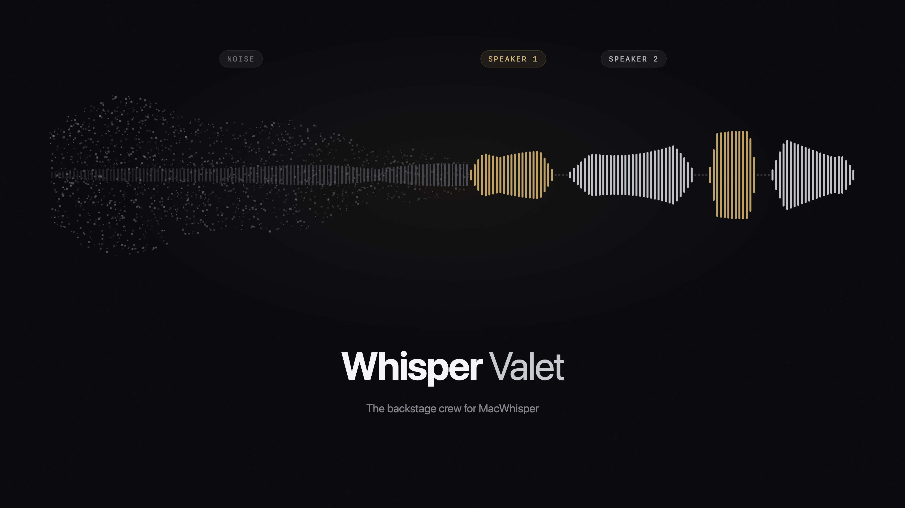

# Whisper Valet



**The backstage crew for [MacWhisper](https://goodsnooze.gumroad.com/l/macwhisper).**
Hand the valet a rough recording — noisy room, one speaker mumbling into their
coffee — and get back restored audio and a speaker-labeled transcript, per
clip, automatically. macOS, fully local: nothing ever leaves your machine.

MacWhisper is a brilliant transcriber. Whisper Valet is everything around it:
the audio restoration *before* the transcription, the speaker attribution
*after* it, and the automation that means you never open an app at all.

```
~/AudioDrop/interview.mp3          you drop this at the valet stand
        │
        ▼   launchd daemon (survives reboots, notifies via macOS)
~/AudioDrop/Processed/interview/
  interview.mp3                    original (parked here, untouched)
  interview.cleaned.mp3            voices isolated from noise, quiet speaker lifted
  interview.cleaned_aggressive.mp3 harder denoise variant
  transcript.txt                   speaker-labeled, grouped by turn
  transcript.srt                   timestamped subtitles
  transcript.json                  word-level timestamps + per-segment confidence
  report.txt                       confidence table; low-confidence turns flagged
```

Works for any recording and any number of speakers — a monologue, a two-person
interview, a five-person panel. Also ships an **MCP server** so Claude (or any
MCP client) can queue files, watch progress, and read transcripts
conversationally.

[Watch the 19-second demo](assets/demo.mp4) — drop, pipeline, results folder,
labeled transcript.

## What the valet actually does

1. **Extract** — ffmpeg pulls a uniform audio stream (video containers work too)
2. **Isolate** — [Demucs](https://github.com/facebookresearch/demucs) separates
   the human voices from background noise onto a clean stem with true silence
   between words
3. **Level** — the quiet speaker is lifted to match the loud one
   (dynaudnorm + loudnorm), so raising them amplifies no noise
4. **Transcribe** — MacWhisper's bundled CLI (`mw`) transcribes the *cleaned*
   audio with word-level timestamps
5. **Attribute** — [pyannote 3.1](https://github.com/pyannote/pyannote-audio)
   works out who speaks when on the *original* audio, and the labels are merged
   onto the transcript

Why step 5 uses the original: voice isolation makes speech easier to *hear*
but smears the vocal timbre that speaker-ID depends on. Transcribing the
cleaned audio while diarizing the original gets the best of both — that split
is the core design decision of this pipeline.

If pyannote can't run (no HuggingFace token, no network), the valet degrades
gracefully to MacWhisper's built-in speaker detection and says so in
`report.txt`. Every segment carries a confidence score; anything below 0.6 is
flagged `<-- verify` so you know exactly which lines deserve a listen.

## Requirements

- macOS on Apple Silicon (Intel works, slower)
- [MacWhisper](https://goodsnooze.gumroad.com/l/macwhisper) — **Pro**, for the
  CLI's JSON export + speaker features (`brew install --cask macwhisper`)
- `ffmpeg` (`brew install ffmpeg`) and [`uv`](https://docs.astral.sh/uv/)
- Optional, recommended: a free HuggingFace token for pyannote diarization
  (setup prints the exact steps)

## Install

```bash
git clone https://github.com/yashkotha/whisper-valet.git ~/whisper-valet
cd ~/whisper-valet && ./setup.sh
```

`setup.sh` builds three pinned Python environments, installs the launchd
watch-folder daemon, and registers the MCP server with Claude Code if the
`claude` CLI is present. Idempotent — re-run it after `git pull`.

> Don't clone into `~/Documents`, `~/Desktop`, or `~/Downloads`: macOS TCC
> blocks launchd agents from reading those folders (silently). `setup.sh`
> warns if you do.

Then drop any `mp3 wav m4a aac flac ogg opus aiff mp4 mov m4v webm` file into
`~/AudioDrop` (the valet stand). A ~3-minute clip takes ~5 minutes on an
M-series CPU. Multiple drops queue sequentially; each file is processed exactly
once (move-out semantics — no ledgers, no double-processing).

## MCP server

`setup.sh` registers `whisper-valet` (user scope) with Claude Code. For other
MCP clients, point them at `<repo>/.venv-mcp/bin/whisper-valet-mcp` (stdio).

| Tool | What it does |
|---|---|
| `process_audio(path)` | Queue one file for the full pipeline (copies it; your original stays put) |
| `process_folder(path)` | Queue every audio/video file in a folder |
| `status()` | Inbox queue, watcher activity, recent clips, log tail |
| `list_clips()` | All processed clips with state |
| `get_transcript(clip)` | Speaker-labeled transcript (+ any low-confidence flags) |
| `get_report(clip)` | Full per-segment confidence table |
| `configure(num_speakers, labels)` | `"auto"`, `"3"`, or `"2-5"` + optional names — applies to future clips |
| `transcribe_quick(path)` | Synchronous plain transcription for short clips — no enhancement, just text |
| `list_models()` | MacWhisper's downloaded models |

Design note: the heavy pipeline runs in the daemon, not in MCP calls. Queue
tools return instantly, so no MCP client timeout can kill a 40-minute job —
`transcribe_quick` is the only synchronous tool, capped at 10 minutes.

Security: user-supplied paths are resolved (symlinks followed) and checked
against an allow-list (`VALET_ALLOWED_PATHS`, colon-separated; defaults to
your home directory), extensions are validated, model ids are
pattern-checked, and subprocesses run argv-only — no shell interpolation.

## Configuration

`config.env` (created by setup, gitignored):

```bash
NUM_SPEAKERS=auto                   # auto = detect per clip; N = force; MIN-MAX = bound (e.g. 2-5)
LABELS=""                           # optional names, e.g. "Interviewer,Responder"
AGGRESSIVE=1                        # also render the harder-denoised variant
NOTIFY=1                            # macOS notifications
#INBOX="$HOME/AudioDrop"            # the valet stand
#MW="/Applications/MacWhisper.app/Contents/MacOS/mw"
```

Any recording works out of the box: `auto` lets pyannote estimate the speaker
count per clip. Force a count (`2`) only when you know it — on hard audio that
measurably improves accuracy. `LABELS` is a hint, not a constraint: names are
applied only when the detected speaker count matches the number of names, so
an "Interviewer,Responder" config can never mislabel a 3-person clip — it just
falls back to `Speaker 1..N`.

Every setting is also overridable via `VALET_*` environment variables.

## Operating the daemon

```bash
tail -f ~/whisper-valet/logs/watcher.log                        # live log
launchctl print gui/$(id -u)/com.whispervalet.watcher | head    # daemon state
launchctl kickstart gui/$(id -u)/com.whispervalet.watcher       # force a sweep
```

A failed clip keeps its folder with `status.txt` = failed and a full
`pipeline.log`; fix the cause and re-drop the original. The daemon fires on
folder changes plus a 5-minute safety sweep, and survives reboots.

## Development

```bash
uv venv .venv && uv pip install --python .venv/bin/python -e . pytest ruff
.venv/bin/pytest -q          # unit tests (no MacWhisper/torch needed — mocked)
.venv/bin/ruff check src tests
```

## Credits

- The MCP-wrapper idea for MacWhisper's CLI was explored first by
  [docdyhr/macwhisper-mcp-server](https://github.com/docdyhr/macwhisper-mcp-server) —
  a clean, well-hardened transcribe wrapper. Whisper Valet borrows its security
  posture (path allow-lists, symlink resolution, argv-only subprocesses) and
  adds the audio-restoration pipeline, research-grade diarization, per-clip
  artifacts, and the reboot-surviving daemon.
- Heavy lifting by [Demucs](https://github.com/facebookresearch/demucs)
  (Meta AI), [pyannote.audio](https://github.com/pyannote/pyannote-audio),
  [MacWhisper](https://goodsnooze.gumroad.com/l/macwhisper) (Good Snooze), and
  ffmpeg. Whisper Valet is an independent project, not affiliated with any of
  them.

## License

MIT
